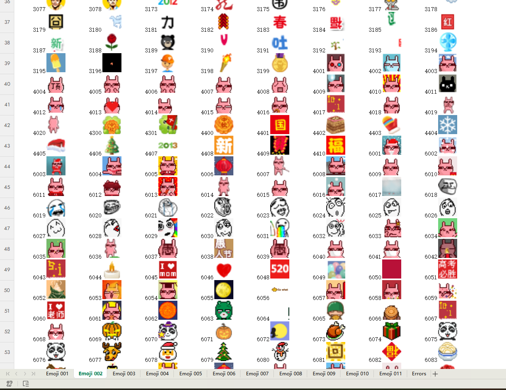
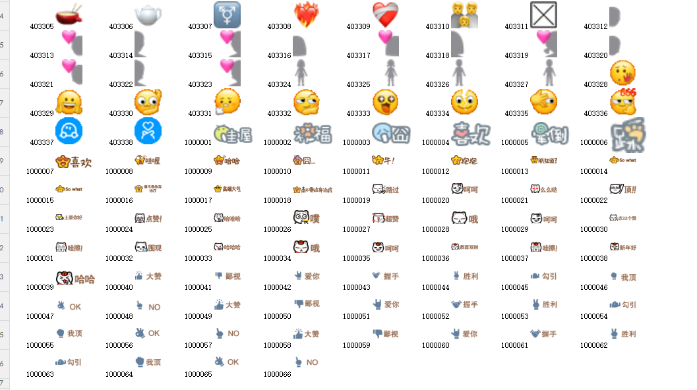

# Qzone Emoji Crawler

一个用于收集、整理和查找 QQ 空间表情的工具。它会按 EID 扫描表情资源，将结果保存到
SQLite，并导出为带图片预览的 XLSX 图册。图册可以保留纯数字 EID，也可以生成
`[em]e{数字}[/em]` 格式的消息代码，复制后直接在 K 歌聊天中发送。例如，EID
`1000004` 的消息代码为：

```text
[em]e1000004[/em]
```

## XLSX 图册效果

导出的工作簿按多个工作表分页展示，每个表情图片旁可以显示纯数字 EID，或显示可直接复制的
完整消息代码。图册相当于一份可视化的表情代码索引，无需逐个尝试代码。





## 使用流程

### 方式一：直接使用 Release 图册

如果只想查找和发送表情，无需运行本项目：

1. 在仓库的 GitHub Releases 页面下载纯数字版 `emoji-catalog.xlsx`，或消息代码版
   `emoji-catalog-message.xlsx`。
2. 打开图册，根据图片找到目标表情。
3. 消息代码版可以直接复制单元格内容；纯数字版需要将 EID 代入 `[em]e{数字}[/em]`。

### 方式二：自行抓取并生成图册

如果需要自行更新数据或调整扫描范围：

1. 运行爬虫，将可用表情和对应 EID 保存到 SQLite。
2. 选择纯数字或消息代码格式，将 SQLite 数据库导出为 XLSX 图册。
3. 打开生成的图册，根据图片查找并复制需要的表情代码。

## 数据与断点续跑

爬取结果写入 SQLite：

- `Emoji(eid, text, gif)`：成功下载的 GIF。
- `Missing(eid, text)`：服务器明确返回 HTTP 404 的 eid。
- `text` 仅作为兼容旧数据的备注字段保留，默认值为空字符串；爬虫不读取或写入它。
- 超时、网络异常、429 和 5xx 不写入数据库，下次运行会自动重试。

数据库模型和查询使用轻量级 ORM [Peewee](https://docs.peewee-orm.com/) 管理，并兼容已有
`Emoji`、`Missing` 表结构。

## 自行抓取数据

需要 Python 3.14.x。

安装依赖：

```bash
uv sync
```

扫描默认区间 `0..1001000`：

```bash
uv run python crawl.py
```

指定区间和并发数：

```bash
uv run python crawl.py \
  --start 0 \
  --end 1001001 \
  --concurrency 32 \
  --timeout 15 \
  --db data/emoji.db
```

`--end` 不包含在扫描范围内。已有 GIF 和已经确认 404 的 eid 会自动跳过。

后台运行：

```bash
nohup uv run python crawl.py --concurrency 32 > data/crawl.log 2>&1 &
```

## 导出 XLSX 图册

将数据库中的图片导出为多工作表 XLSX 图册。默认生成纯数字 EID 版本：

```bash
uv run python export_xlsx.py \
  --db data/emoji.db \
  --output data/emoji-catalog.xlsx \
  --pairs-per-row 8 \
  --per-sheet 800 \
  --image-size 48 \
  --eid-format number
```

生成可直接复制的消息代码版本：

```bash
uv run python export_xlsx.py \
  --db data/emoji.db \
  --output data/emoji-catalog-message.xlsx \
  --eid-format message
```

`number` 格式写入纯数字 EID；`message` 格式写入 `[em]e{eid}[/em]`。GIF 和 PNG 会保留
原始数据；WebP 等格式会转换为静态 PNG。无法解码的记录会写入 `Errors` 工作表。

## 代码结构

- `crawl.py`：爬取命令的轻量入口。
- `export_xlsx.py`：Excel 导出命令的轻量入口。
- `src/crawler/`：爬取配置、单图下载、批处理服务和 CLI。
- `src/database/`：Peewee 模型、持久化行类型和 SQLite 仓储。
- `src/export/`：导出配置、纯图片处理、XLSX 编排和 CLI。
- `tests/crawler/`、`tests/database/`、`tests/export/`：按功能模块镜像组织的测试。

## 开发检查

```bash
uv run pytest
uv run ruff check .
uv run ruff format --check .
```
